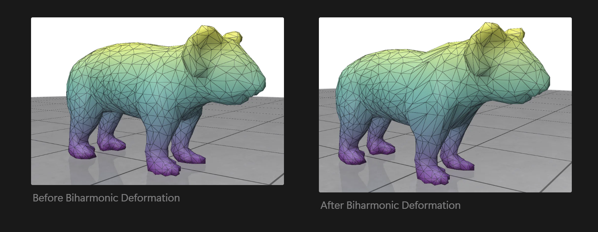

# Biharmonic Deformation

A Python implementation of harmonic and biharmonic deformation techniques for 3D meshes, with interactive visualization using Polyscope.

Biharmonic deformation is a powerful technique used in geometry processing, computer graphics, and computational geometry for smoothly deforming 3D shapes or meshes. It is particularly useful when we want to deform a shape while maintaining its smoothness and structural integrity. This method finds applications in mesh editing, shape interpolation, and surface modeling.




## Features

- Harmonic and biharmonic deformation of 3D meshes
- Interactive visualization using Polyscope
- GPU acceleration with CUDA or MPS (Metal Performance Shaders for Mac)
- Mesh simplification with PyMeshLab
- Demo examples: cube deformation and koala mesh deformation

## Installation

### Requirements

- Python 3.8 or higher
- GPU with CUDA support (optional, for faster computation)
- MacOS with Metal support (optional, for MPS acceleration)

### Setup

1. Clone this repository:
   ```
   git clone https://github.com/pawpaw2022/BiharmonicDeformation
   cd BiharmonicDeformation
   ```

2. Install dependencies using pip:
   ```
   pip install -r requirements.txt
   ```

   Note: If you're using a Mac with Apple Silicon and want to use MPS acceleration, make sure to install the PyTorch version compatible with MPS.

3. Download the koala mesh (for the koala demo):
   - Create a directory named `koala` in the project root
   - Place a koala.obj file in this directory
   - You can find various 3D models online or use your own 3D model

## Usage

The project includes two main demos:

### Cube Deformation Demo

Run the cube deformation demo with:

```bash
python src/HarmonicDeformation.py
```

For Mac users with Apple Silicon, you can enable MPS acceleration using the `--mps` flag:

```bash
python src/HarmonicDeformation.py --mps
```

You can also use the API directly in your Python code:

```python
# In Python
from src.HarmonicDeformation import demo
demo(mps=True)
```

### Koala Mesh Deformation Demo

Run the koala mesh deformation demo with:

```bash
python src/Koala.py
```

For Mac users with Apple Silicon, you can enable MPS acceleration using the `--mps` flag:

```bash
python src/Koala.py --mps
```

You can also customize the mesh and simplification parameters:

```bash
python src/Koala.py --mesh path/to/your/mesh.obj --vertices 2000 --mps
```

Alternatively, you can use the API directly in your Python code:

```python
# In Python
from src.Koala import main
main(mps=True)

# With custom parameters
main(mesh_path="path/to/your/mesh.obj", target_vertices=2000, mps=False)
```

## Interactive Controls

In the Polyscope viewer:

1. Click "Toggle Animation" to start/stop the deformation animation
2. Use the mouse to rotate, pan, and zoom the view:
   - Left-click and drag to rotate
   - Right-click and drag to pan
   - Scroll to zoom
3. Additional controls are available in the Polyscope UI for adjusting visualization settings

## Implementation Details

The implementation uses the cotangent Laplacian for mesh deformation with the following key components:

- Cotangent Laplacian computation for mesh surfaces
- Boundary condition handling for controlled deformation
- Linear system solvers with fallback mechanisms for robust computation
- Interactive animation with real-time deformation updates

## Learn More

For more information about biharmonic deformation and geometric processing techniques, visit:
https://paul-l-sining.notion.site/Biharmonic-Deformation-1a19dddde89c803094c7e85bf1ede2e8


For our presentation slides, visit: 
https://docs.google.com/presentation/d/1SHOtGzko9fwXSyt4h2hFVh-dQqeUCX7OVKDd_GKNKs0/edit#slide=id.g33345faad39_0_818


